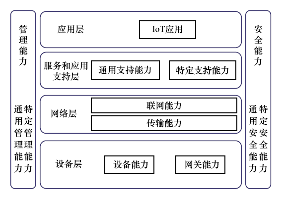
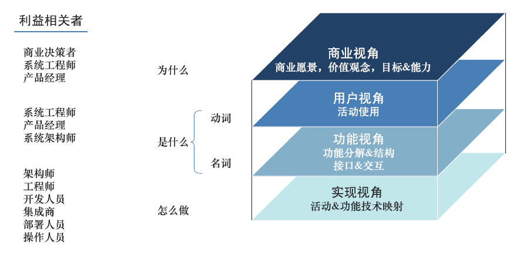
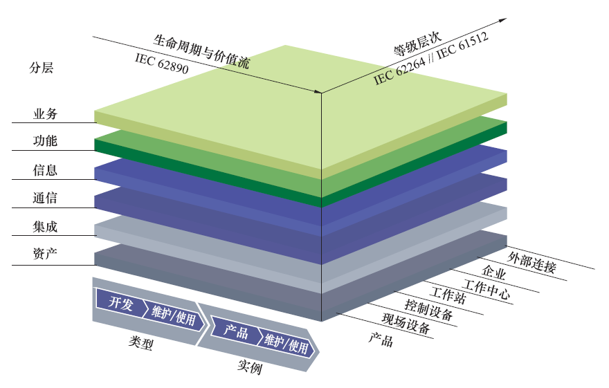
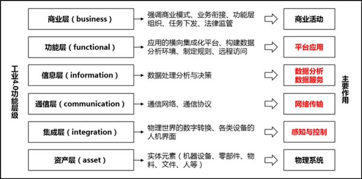
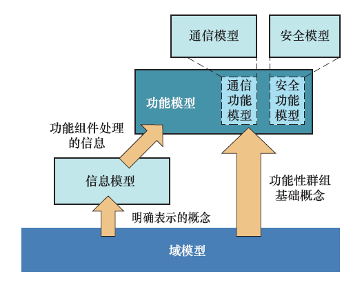
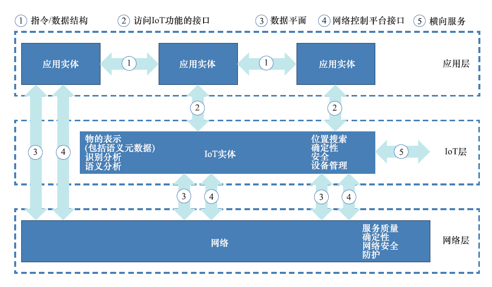
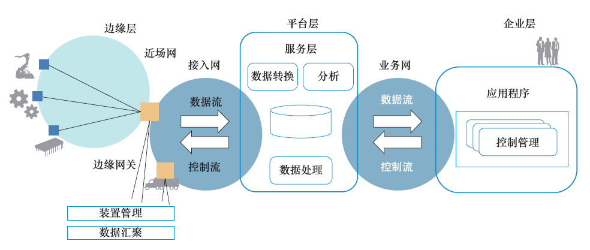
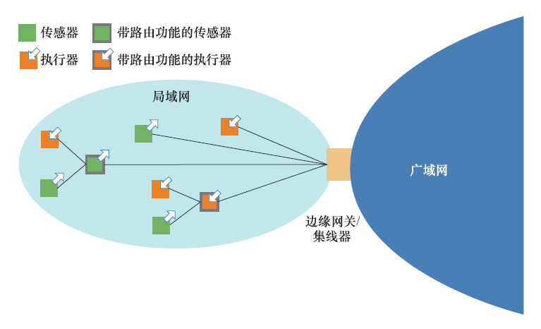

## 1 引言
IOS/IEC对物联网(IoT)的定义是：“一种物、人、系统和信息资源互联的基础设施，结合智能服务，使其能够处理物理和虚拟世界的信息并作出响应”。
### 1.1 背景
目前IoT应用主要集中在通过附接到设备的各种传感器收集性能和环境数据，在接近设备的进场（proximity network）中执行初步分析，或者通过特定的网络将数据传输到企业内部或云平台。对于不强调远程设备控制能力的多种IoT应用以及主要用于数据检索、归档等批处理应用，现有的模型已经能够支撑其应用及部署。
但上述方法并未充分发挥新兴的颠覆性技术的真正优势，存在以下问题：
- 投资回报率（ROI）较低
- 企业决策者对是否投入资源大力发展IoT技术抱有疑虑
- 新问题、新挑战
    - 安全性问题（先前被隔离、受到高度保护的设备可能会暴露在显著的风险环境中）
    - 数据隐私问题（越来越多的个人信息被采集和共享）
    - 数字化障碍（工业和公众领域的众多设备已经过时，可能面临不能数字化、不能连接到IoT网络等问题，与消费电子领域相比，新设备投资高得多）
### 1.2 进展

## 2 IoT发展现状
### 2.1 IoT组件
#### 2.1.1  物理装置
#### 2.1.2 边缘
#### 2.1.3 平台

### 2.2 IoT系统设计
#### 2.2.2 ITU-T Y.2060

#### 2.2.3 IIC IIRA
工业互联网联盟（IIC）致力于IoT的工业应用，其提出的工业互联网参考架构（IIRA）定义了四个视角：商业、用户、功能和实现。

#### 2.2.4 RAMI 4.0
工业4.0参考架构模型（RAMI 4.0）

#### 2.2.5 IoT-A ARM
IoT-A作为欧盟第七框架计划的灯塔综合项目，开发出IoT-A架构参考模型（ARM）作为基础参考架构文档。

#### 2.2.5 AIOTI参考架构
物联网创新联盟（AIOTI）

### 2.3 架构模式
#### 2.3.1 三层架构
三层架构由边缘层、平台层及企业层组成，三层之间由近场网、接入网和业务网连接。

#### 2.3.2 介导网关边缘的连接和管理

#### 2.3.3 边缘-云架构
#### 2.3.4 多层数据存储
#### 2.3.5 分布式分析
#### 2.3.6 Lambda架构
批处理层、服务层、实时处理层。兼顾实时响应和深入分析。
### 2.4 IoT典型特征
#### 2.4.1 数据关联和信息检索
智能数据处理是IoT的关键特性之一。当前IoT具备支持传感器的泛在部署及数据的快速有效采集能力，将促进新的协同模式的发展。IoT系统中的组件产生了不同特征类型的数据，如流、批处理和异步数据。如在小的学习任务中的数据处理，通常会被推向边缘，而大规模的处理倾向于集中化。这些数据被处理后可用于系统反馈、流程改进、故障检测以及真实情境与业务流程融合。
#### 2.4.2 通信
目前，IoT中的通信主要通过VPN或公共网络，其通信能力已经跨越了传统企业间的“孤岛”，允许来自多个异构实体的信息采集。
#### 2.4.3 集成和互操作
目前IoT解决方案的特色是不同程度的集成和互操作。
#### 2.4.4 安全、隐私和可信
目前IoT关于安全方面的功能大致可分为传感器安全、装置安全、边缘安全、云基础设施及网络安全四个方面。传感器受制于有限的处理能力和资源，往往由于加密算法和密钥管理的开销较大，导致相关的安全机制不足。在很多行业应用领域，如传统工业装置、智能家居消费电子产品，装置安全也面临同样的问题。
IoT装置通常是物理可访问的，因此应提供多级保护：
- 网络安全
- 设备和传感器自身的保护
- 设备安全监视和威胁分析（边缘及平台相结合）
